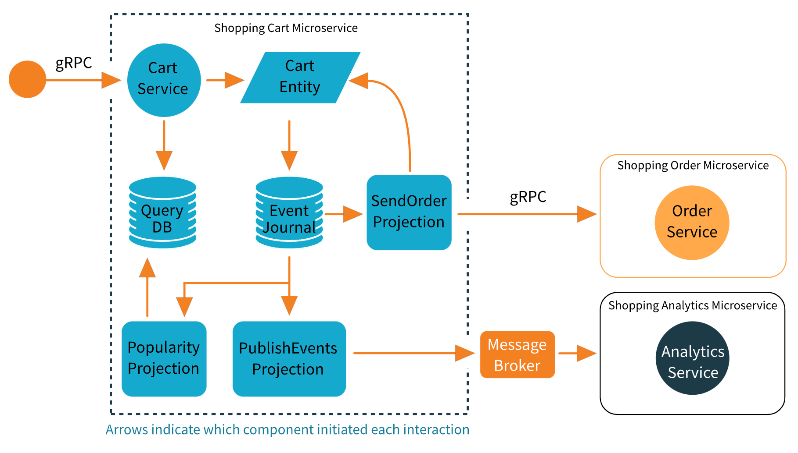

## Shopping Cart - Akka {CQRS + gRPC} Microservices

**Architecture Diagram**

- Photo Credit: https://developer.lightbend.com/docs/akka-guide/microservices-tutorial/overview.html
- Example Credit: https://developer.lightbend.com/docs/akka-guide/microservices-tutorial/template.html

---

## Conclusion

---

### References

- <https://github.com/apache/pekko-samples>
- <https://github.com/apache/kafka/blob/trunk/docker/examples/README.md>

